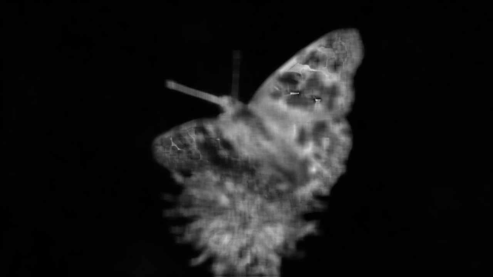
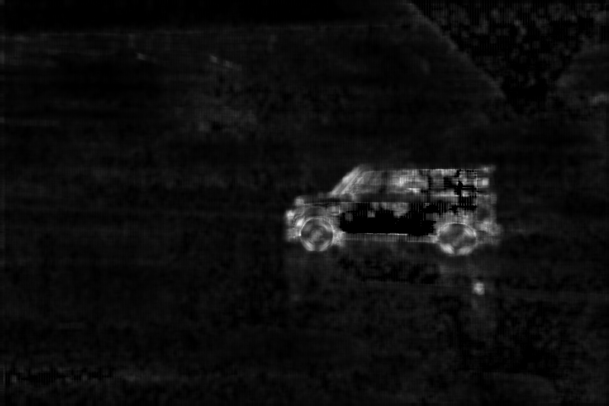

# Blurred Region Detection using Singular Value Decomposition (SVD)

## Requirements:
Python;OpenCV;Numpy

## Usage:

### get_blur_degree
input: image_file, sv_num=10
output: blur degree [0(clear)-1(blur)]

### get_blur_map
input: image_file, win_size=10, sv_num=3
output: blur map [0-1].

### sample code

````
import glob
from blur_detection import *
files = glob.glob('data/test*')
for file in files:
     print file, get_blur_degree(file)
     out_file = file.replace('test_image','blur_map')
     blur_map = get_blur_map(file)
     cv2.imwrite(out_file, (1-blur_map)*255)
````

## Some Results:







## Related paper:
[Blurred Image Region Detection and Classification](http://fled.github.io/paper/blur.pdf)
Bolan Su, Shijian Lu, Chew Lim Tan
ACM Multimedia 2011

@inproceedings{
 author = {Su, Bolan and Lu, Shijian and Tan, Chew Lim},
 title = {Blurred Image Region Detection and Classification},
 booktitle = {Proceedings of the 19th ACM International Conference on Multimedia},
 series = {MM '11},
 year = {2011},
} 
